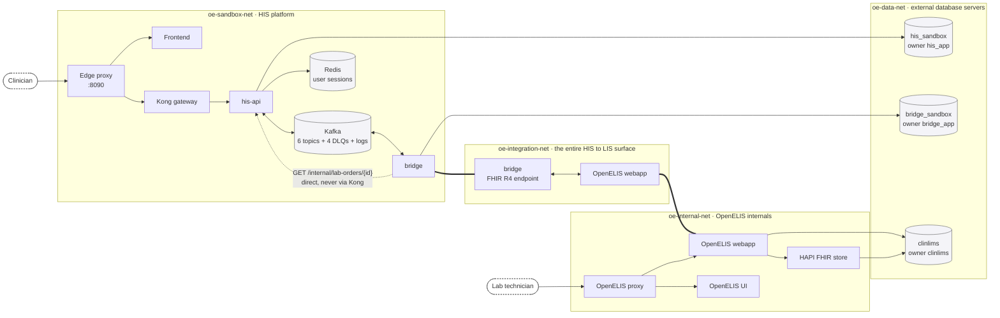
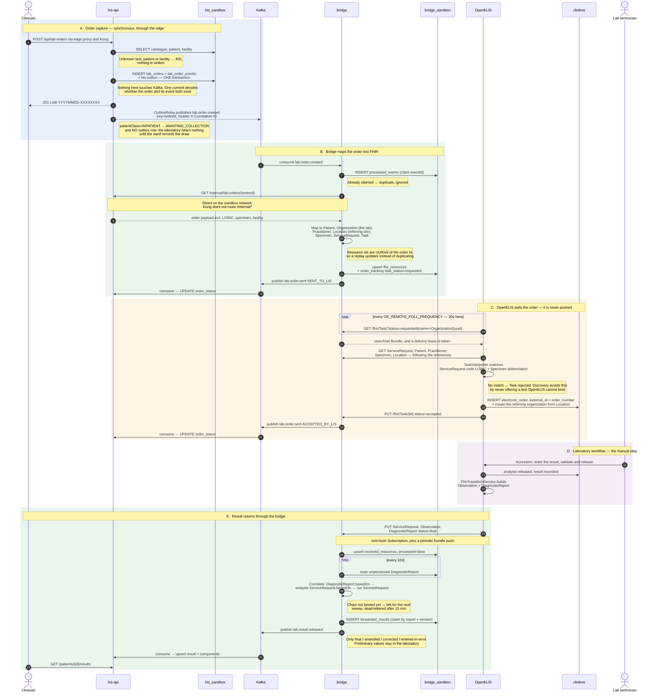
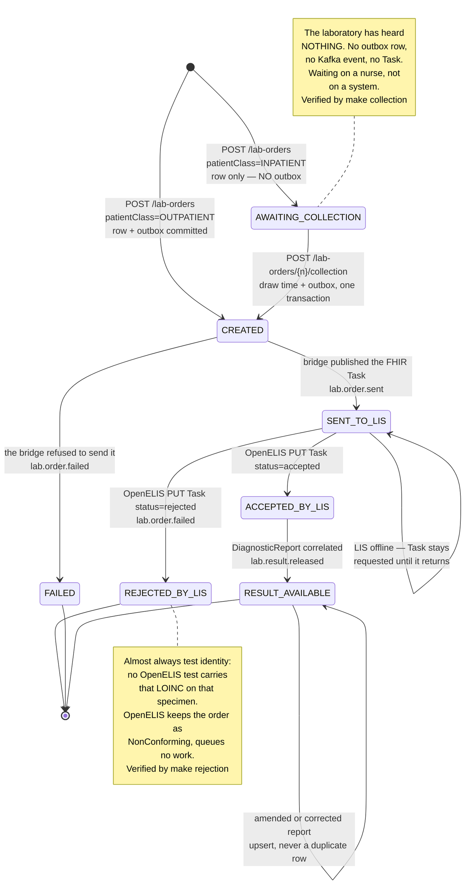
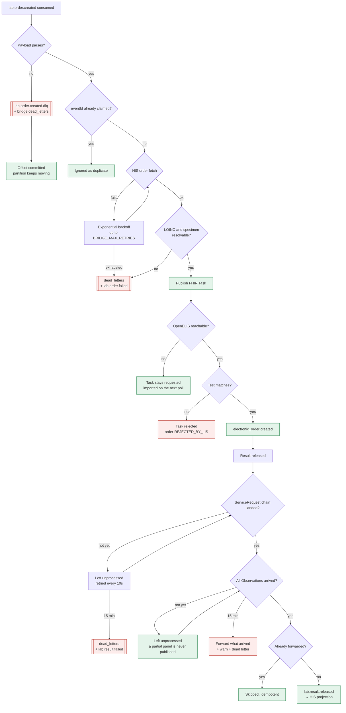
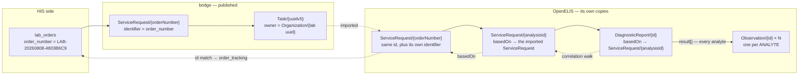
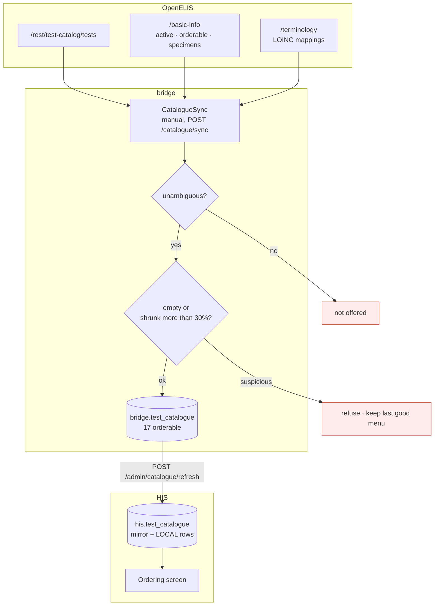
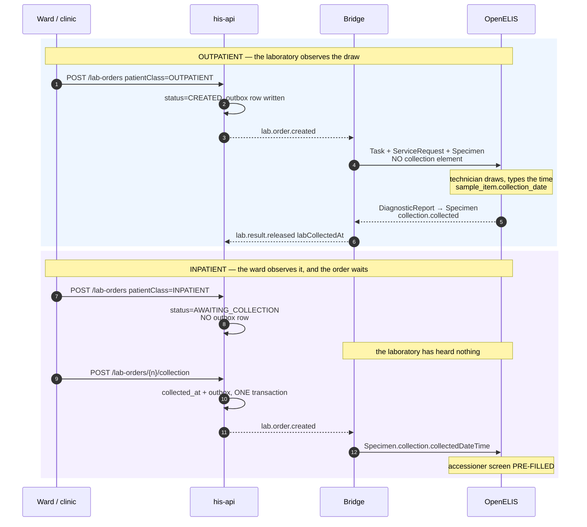

# Architecture

What runs, why it exists, where state lives, and how an order actually travels.

This is the first thing to read. Every container, network, database, topic and
count below was read off the running system rather than sketched — including the
numbers, which is why some of them are oddly specific.

---

## 1. The shape of it in one paragraph

A doctor places a lab order in the HIS. The HIS publishes an event. A **bridge**
consumes it, turns it into FHIR, and holds it until OpenELIS asks. OpenELIS polls
the bridge, imports the order, and a laboratory technician does the physical
work. When a result is released, OpenELIS pushes it to the bridge, which
correlates it back to the original order and hands it to the HIS.

Two systems, neither of which knows the other exists. Everything specific to
OpenELIS lives in one place: the bridge.

---

## 2. Containers

Fifteen long-running containers, plus four that do one job and exit. **Stock**
means an unmodified upstream image; **ours** means built from this repository.

### The HIS sandbox — stands in for your real HIS

| container | image | ours? | what it is |
|---|---|---|---|
| `his-frontend` | `his-sandbox/frontend:local` | ours | the doctor's screen: search a test, place an order |
| `his-edge-proxy` | `nginx:1.27-alpine` | stock | the public entrance, port **8090** |
| `his-kong` | `kong:3.9.3` | stock | API gateway — routing, auth enforcement |
| `his-api` | `his-sandbox/his-api:local` | ours | patients, orders, results, the test menu |
| `his-kafka` | `apache/kafka:4.3.1` | stock | the event backbone |
| `his-redis` | `redis:7-alpine` | stock | user sessions — one per user, in memory |
| `his-consul` | `hashicorp/consul:1.20` | stock | service registry and health |
| `his-prometheus` | `prom/prometheus:v3.1.0` | stock | scrapes the bridge, his-api and Kong; evaluates the alert rules |
| `his-db-external` | `postgres:16-alpine` | stock | **two** databases: `his_sandbox` and `bridge_sandbox` |

### The bridge — the integration itself

| container | image | ours? | what it is |
|---|---|---|---|
| `bridge` | `his-sandbox/bridge:local` | ours | the whole integration: consumes order events, maps to FHIR, serves OpenELIS's poll, receives results, correlates them back |

**One container.** Everything OpenELIS-specific is inside it — the FHIR shapes,
the sample-type vocabulary, the polling contract, the correlation chain.

### OpenELIS — the laboratory system

| container | image | ours? | what it is |
|---|---|---|---|
| `openelis-webapp` | `itechuw/openelis-global-2:3.2.2.0` | **stock** | the LIS application |
| `openelis-frontend` | `…-frontend:3.2.2.0` | stock | the lab user's React UI |
| `openelis-proxy` | `…-proxy:3.2.2.0` | stock | OpenELIS's own nginx, ports **80/443** |
| `openelis-fhir` | `…-fhir:3.2.2.0` | stock | HAPI FHIR store, OpenELIS's working store |
| `openelis-db-external` | `…-database:3.2.2.0` | stock | `clinlims`, the laboratory database |

### The four that exit

`openelis-certs` and `openelis-peer-cert` put the mTLS material in place,
`openelis-trust-bridge` imports our CA into OpenELIS's truststore, and
`his-kafka-init` creates the topics. All four show `Exited (0)` in `docker ps -a`
when the stack is healthy — that is success, not a crash.

**`openelis-certs` copies rather than generates.** The `certgen` image ships
prebuilt keystores in its layers, so OpenELIS's certificate is a property of the
pinned digest, not something made at install time. Changing it means changing
the digest and clearing the volumes — `make certs-rotate`, and
[operations.md](operations.md#replacing-openeliss-tls-certificate).

> **On patching.** The webapp is the only image we could ever build ourselves,
> and only when `OE_IMAGE_REPO=his-sandbox`. Today that is moot: this repository
> carries **no patches**, so a self-built image would be identical to stock. One
> patch was carried and then retired once measurement showed the bridge's
> delivery lease already covered it — see
> [openelis-patches/README.md](../openelis-patches/README.md). `docker ps` always
> shows which build is running.

---

## 3. Networks — the boundary is physical

Four networks. Membership is the interesting part: the bridge is the only
container on both `sandbox` and `integration`, which makes it the only path
between the two systems.

Two consequences fall out of that, and they are the point of it:

- **`his-api` is not on `oe-integration-net`.** The HIS *cannot* reach OpenELIS,
  even by accident. Every order goes through the bridge.
- **`openelis-webapp` is not on `oe-sandbox-net`.** OpenELIS cannot reach the HIS
  API, Kafka or Redis. It only ever talks to the bridge.

The separation isn't a convention people have to remember. A container that tried
to shortcut it would fail to resolve the hostname. Three databases, three owners,
no shared credentials — verified: the bridge's role is refused `CONNECT` on
`his_sandbox`, and OpenELIS holds no HIS credentials at all.

### Where membership was doing more work than it should have

For the *databases* that boundary is complete. For the bridge's own HTTP surface
it was not. `bridge` sits on both networks and served `/fhir`, `/ops/*` and
`/catalogue/*` to both, so anything on `sandbox` — the HIS service, the frontend,
Kong — could post a `DiagnosticReport`. A fabricated `DiagnosticReport` is a
fabricated patient result.

The surface is now split by *what the caller is*, not by which port it arrived on:

| Surface | Who | How they are checked |
|---|---|---|
| `/fhir` | OpenELIS | **origin** — the peer must resolve from `BRIDGE_FHIR_ALLOWED_PEERS`, over mutual TLS |
| `/ops/*`, `/catalogue/sync` | operators | **bearer token**, fail-closed |
| `/health`, `GET /catalogue` | anything internal | open, read-only |

The first row is an origin check rather than a credential for a reason that is
not going to change: **OpenELIS has no way to send one.** Its
`BasicAuthInterceptor` is gated on the target being its own local FHIR store, and
there is no configuration key for remote-source credentials at all — see
[security.md §3](security.md#3-why-the-fhir-endpoint-has-no-token--and-how-it-is-secured-instead).
Demanding a token on `/fhir` would not secure the integration, it would stop it.

That makes this the one boundary held by something weaker than a credential,
which is worth knowing rather than glossing.

---

## 4. Where state lives

| store | contains | survives restart? |
|---|---|---|
| `his_sandbox` (schema `his`) | patients, lab orders, results, test-menu mirror, audit trail | yes — volume |
| `bridge_sandbox` (schema `bridge`) | FHIR resources, order tracking, catalogue, delivery leases, dead letters | yes — volume |
| `clinlims` | everything the laboratory owns: samples, analyses, results | yes — volume |
| Kafka | order events **in flight** | yes — but see below |
| Redis | user sessions | **no** — a restart is a system-wide logout, by design |
| Consul | service registry, health | no — rebuilt on start |
| Prometheus | scraped metrics, 2-day window | yes — volume, but deliberately short: it answers "what happened yesterday", not "what happened in March" |

**Two servers, three databases.** `his_sandbox` and `bridge_sandbox` share the
`his-db-external` server — a sandbox convenience to save a container. They are
separate *databases*, not schemas in one, so **no service can join across them**:
the bridge cannot read `his.patients`, it must call the HIS API. In production
they would be separate servers, because the HIS and the bridge are different
trust domains.

**Kafka is a source of truth while an order is in flight**, not just a pipe. An
order accepted by the HIS but not yet delivered exists *only* as a Kafka event
plus an outbox row. It runs here as **one broker, replication factor 1** — fine
for a sandbox, a single point of failure for a laboratory. See
[integration-guide.md](integration-guide.md#from-integration-to-production).

---

## 5. The round trip

One order, from a clinician typing it to the released result appearing back in
the HIS. Five phases; **D is the only one a human drives**.

Three details matter more than they look:

**OpenELIS pulls, we don't push.** The bridge holds the order and waits. That is
OpenELIS's design, and it means the laboratory is never interrupted by us.

The cadence is a Spring
`@Scheduled(fixedRateString = "${org.openelisglobal.remote.poll.frequency:120000}")`.
Two minutes is only the compiled-in fallback — **this stack runs 30 s**, set from
`OE_REMOTE_POLL_FREQUENCY` in `.env` and rendered into `common.properties`, which
the container mounts over the stock file. Read the running value there rather
than from the WAR, where the property is commented out and looks unset. Measured
at idle: five mutually authenticated FHIR requests per minute.

`fixedRate` rather than `fixedDelay` matters too — a slow import does not delay
the next poll, so with `@Async` the two can overlap. That is the mechanism behind
[defect 01](upstream-issues/01-task-poll-not-idempotent.md).

**Results correlate by a two-hop chain**, not by patient or timestamp. See §8.

**An inpatient order does not start at the top of that diagram.** It is held at
`AWAITING_COLLECTION` with no outbox row until a nurse records the bedside draw —
see §9.

---

## 6. Order status lifecycle

Each transition is driven by a specific event, so a stuck order tells you exactly
which hop failed.

`labProgress` is a **second axis underneath `ACCEPTED_BY_LIS`**, not a status:
`IN_LABORATORY`, then `AWAITING_VALIDATION`. It only advances, and it never
contradicts the status.

**`AWAITING_COLLECTION` is not a failure, and not progress.** It is the only
state in which nothing has been sent to the laboratory. An order sitting here is
not stuck in a hop; it is waiting on a physical act that has not happened. Every
other stalled state means a system did not do its job — this one means a specimen
has not been drawn, and no amount of restarting anything will move it.

---

## 7. Failure and recovery

What happens when a hop breaks, and how the data gets through anyway.

Every arrow is exercised by `make negative`, except the two dead-letter timeouts,
which are time-based. The Observation branch is `make panel` §8.

**Why the report waits for its own analytes.** OpenELIS pushes a report's
`Observation`s in separate deliveries, so a panel routinely arrives before its
components. The forward is claimed once per (report, version), so publishing
early would be *final* — the analytes still in flight would arrive to find the
version already forwarded and be dropped for ever. Waiting costs one sweep;
claiming early costs the result. That is why resolution is checked **before** the
claim rather than after.

---

## 8. The chain that holds a result to its order

Correlating a released result back to a HIS order is the subtlest part of the
design, because OpenELIS renames nothing but re-parents everything.

Two facts make the walk reliable, both confirmed against resources OpenELIS
actually pushed back:

- OpenELIS **preserves our `ServiceRequest` id** when it imports the order, so
  the parent reference resolves directly against `bridge.order_tracking`.
- It also stamps its own identifier on that copy **and keeps our order-number
  identifier**, giving a second, independent way to match if the id chain ever
  breaks.

The bridge tries the direct id match first, then the parent hop, then the
order-number identifier — `resolveOrder` in
[result.correlator.ts](../services/bridge/src/modules/results/result.correlator.ts).

**The parent hop is the one that matters in practice.** A real released result,
captured from OpenELIS rather than simulated, arrived as
`DiagnosticReport.basedOn → ServiceRequest/f71f7cc1… → ServiceRequest/LAB-…`. A
correlator that only looked one level deep — the obvious implementation — would
have passed every simulated test and failed on every real result.

**`DiagnosticReport.result` is a list.** A full blood count is one report and
eight `Observation`s. Every test on this sandbox's menu happens to measure a
single analyte, which is exactly why the list was once read as though it held one
element — the correlator forwarded `result[0]` and dropped the rest, and nothing
failed, because there is no count anywhere to disagree with. Now every analyte
travels in `observations[]` and lands in `his.lab_result_components`, one row
each, **replaced wholesale** on every upsert because a corrected report is a new
statement about every analyte in it.

---

## 9. Two flows worth drawing

### Where the test menu comes from

The HIS does not decide which tests exist. OpenELIS does, and the bridge asks it.

A test is offered if OpenELIS reports it **active**, **orderable**, holding
**exactly one LOINC**, and carrying a sample type with a **local abbreviation**.
The menu currently holds **17 rows**, one per (test, specimen) — a LOINC says
what is measured, not what it is measured in, so `10351-5` names three orderable
things and the doctor picks which, at the only point where the answer is certain.

What is refused is a LOINC **and** specimen claimed by two active tests. That is
a mapping error in the laboratory's catalogue, and the sync naming it is the loop
working. Full detail, including why the sync is deliberately manual and why the
HIS keeps a mirror rather than calling through, is in
[integration-guide.md Step 1](integration-guide.md#step-1--decide-who-owns-the-test-menu).

### Who observes the draw

A collection time is a fact about a physical event, and only whoever watched it
can state it. That one rule decides which direction the data moves.

Why it is worth the trouble: the results table used to show a single time, the
moment the laboratory signed the result out. A doctor reading "released 11:30" at
11:35 concludes the value is current. If the blood was drawn at 06:00 it is five
and a half hours old and the patient has had fluids since. Nothing on the screen
was wrong; there was not enough of it. ISO 15189:2022 7.4.1.7.a requires the
collection time when it matters for patient care, and this is that case.

Two traps, both verified in 3.2.2.0 source:

- **`Observation.effective` is the RELEASE time, not the collection time.**
  OpenELIS sets it to `analysis.getReleasedDate()`, falling back to
  `getStartedDate()`. Following the FHIR convention here gets you a plausible
  timestamp, hours wrong, with nothing failing.
- **A `collection` element does not imply a collection date.** OpenELIS calls
  `specimen.setCollection()` unconditionally while null-guarding
  `setReceivedTime()` directly above it, so a specimen with no collection date
  still arrives carrying a `collection` element built around a null. Test for the
  date, not the element.

Both columns are nullable, and null is a first-class state displayed as **"not
recorded"**. A fabricated collection time is worse than none. The workflow rules
are in [integration-guide.md Step 3b](integration-guide.md#step-3b--patient-class-decides-the-collection-workflow).

---

## 10. What the test frontend shows, and why it is arranged that way

Four things in the demo UI are deliberate rather than cosmetic, because each
teaches something a real HIS has to get right:

**The visit sits beside the PATIENT, not on the order form.** A doctor is inside
an encounter and places several orders within it; a box on the form would invite
retyping it per test and teach the opposite of the one-visit-many-orders model.

**The ordering provider is displayed, never editable.** It comes from the
verified token. A prefilled name field once meant an order could be attributed to
a colleague by nobody doing anything at all.

**Two identifiers sit side by side on a result.** `orderNumber` for this system,
`labAccession` for the laboratory's — because they are quoted to different
people, and only the second is useful to whoever answers the laboratory's phone.

**A panel's analytes are rows beneath their report, not a second table.** Each
keeps its own reference range and its own severity, because a panel that is
normal in seven analytes and critical in the eighth is a report whose entire
meaning lives in the eighth.

---

## 11. Trust and identity

| hop | how it is secured |
|---|---|
| browser → edge → Kong | user token, verified at the gateway |
| his-api → Kafka | inside `oe-sandbox-net`, not exposed |
| **bridge ↔ OpenELIS** | **mutual TLS** — client certificates both ways, issued by our own CA, pinned by certificate |
| bridge ops endpoints | operator token or an estate user token |
| bridge → OpenELIS REST | servlet form login as a service user (OpenELIS gates its catalogue endpoints behind `hasRole('ADMIN')`) |

The mTLS material lives in the `oe-certs`, `oe-keys` and `oe-key-trust-store`
volumes. **Ours** — the CA and the bridge's certificate — is issued by
`make certs`. **OpenELIS's** is not issued here at all: it arrives prebuilt
inside the `certgen` image and is exported from its truststore, so replacing it
is `make certs-rotate` rather than `make certs`. OpenELIS reads its truststore
once, at startup, which is why `make trust-bridge` restarts it.

---

## 12. Not built: referral testing

When our laboratory cannot perform a test it sends the specimen to another
laboratory. **Nothing here does that yet and no referral has ever run.** What
follows is the state of the plumbing, verified against 3.2.2.0.

**OpenELIS has a real referral module**, not a stub. `clinlims.referral` records
the receiving organisation, `sent_date`, `result_recieved_date`, a reason, a
priority, and the unhappy paths explicitly — `lost_status` / `lost_date` /
`lost_reason` and `canceled` / `cancel_reason`. `referral_result` links the value
that came back; `shipment` / `shipping_box` track the physical package. The
vocabularies ship seeded, and `organization_type` id **6** is `referralLab`. The
workflow is post-accessioning: a sample is referred after it arrives.

**The gap that decides how hard this is:** `DiagnosticReport.performer` and
`Observation.performer` are **never set anywhere in OpenELIS** — zero call sites
for `setPerformer` or `addPerformer`. No field on a returning result says who
performed it. That matters beyond convenience: ISO 15189:2022 7.4.1.7.c and CLIA
42 CFR 493.1291(i)(3) both put the duty to name the performing laboratory on the
*referring* laboratory's report. Naming it means walking
`DiagnosticReport → analysis → referral Task → Organization` — **a chain that has
never been exercised**, so nothing should be built against an assumption about
its shape.

**What was done ahead of time.** `Organization` is in
`org.openelisglobal.fhir.subscriber.resources` (in `openelis/generated/common.properties`,
which overrides the stock default) and in the bridge's supported types, taking
the subscriptions from 8 to 9. Subscribing before there is anything to receive is
deliberate: resources are pushed *when they change*, so a reference laboratory
configured last month is not re-pushed because we started listening today.

> **Trap for anyone editing that property.** The bridge's supported types must
> stay a **superset** of the subscriber resource list. OpenELIS registers one
> Subscription per name and pushes unconditionally; a type it pushes that the
> bridge does not accept is refused at the door, which surfaces as a permanently
> failing export on the *laboratory's* side and nothing visible on ours. Adding a
> name to the property without adding it to the bridge is strictly worse than not
> subscribing at all.

**The cheap half is worth doing first.** A send-out takes days; today an order
would sit at `ACCEPTED_BY_LIS` for a week with no explanation and the ward would
telephone. `REFERRED_OUT` belongs on the existing `labProgress` channel — not as
an order status, because the integration state has not changed. Two more come
from the dedicated publishers `publishReferralLost` and `publishReferralRejected`:

| Progress | What the ward does |
|---|---|
| `REFERRED_OUT` | stop expecting it tomorrow; stop telephoning |
| `REFERRAL_LOST` | **redraw the patient** |
| `REFERRAL_CANCELLED` | the test is not coming; decide what to do instead |

`REFERRAL_LOST` should not be a quiet grey note — it belongs with the correction
alerting in [integration-guide.md Step 6c](integration-guide.md#step-6c--corrections-need-an-alert-not-a-badge).

**One instruction to give the laboratory before the first send-out**, because it
is unrecoverable afterwards:

> When a specimen is sent to another laboratory, use OpenELIS's referral
> function. Do not enter the result as though it was performed in-house.

A result typed in as in-house has no organisation, no sent date and no link to
the sample that left the building. A year of send-outs recorded that way cannot
be reconstructed, and each one is a result a clinician will trend against an
in-house value as though the two were comparable.

---

## 13. Reading order

| you are | read |
|---|---|
| new to this | this file |
| wiring the real HIS | [integration-guide.md](integration-guide.md) |
| deciding what to send | [integration-contract.md](integration-contract.md) |
| running or fixing it | [operations.md](operations.md) — start with its alerts section |
| watching it | [monitoring.md](monitoring.md) — the collector, the metrics, the rules |
| assessing risk | [security.md](security.md) |
| improving the real HIS | [his-findings.md](his-findings.md) |
| wiring lab tests to billing | [billing-integration.md](billing-integration.md) |
| judging whether it is any good | [archive/audit.md](archive/audit.md) — independent review and what it changed |
| changing OpenELIS itself | [openelis-patches/README.md](../openelis-patches/README.md) |
