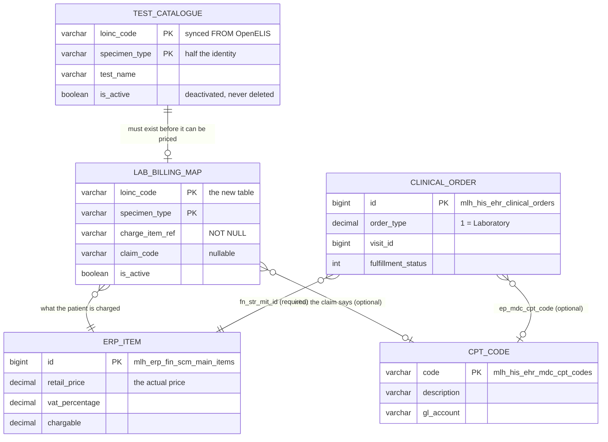

# Billing: connecting lab tests to CPT codes

**For the developers who will build billing into the real HIS.**

The laboratory knows what a test *is*. Your HIS knows what it *costs* and what
the claim calls it. This document is about the join between those two, what has
been built here as a foundation, and — just as important — what has deliberately
been left for you to decide.

Plain English throughout. Where it names a table in your real HIS
(`HIS Project`), that name was read from your own Prisma schema, not guessed.

---

## 1. The short version

- The laboratory identifies a test by a **LOINC code plus a specimen**.
- Your HIS charges using an **ERP item**, and claims using a **CPT code**.
- Something has to join them. That something is one small table, and it belongs
  in your HIS, filled in when you deploy at a hospital.
- **You already have almost everything else.** The table below is the only
  genuinely new thing.

---

## 2. What CPT is, briefly

CPT — *Current Procedural Terminology* — is a set of five-character codes owned
by the American Medical Association. Insurers use them to know what procedure
they are paying for. Laboratory work sits in the 80000–89398 block, and panels
have codes of their own (80047–80076).

Three things matter for this work:

**CPT is coarser than LOINC.** One CPT code usually covers several LOINC codes.
So the mapping is *many LOINC → one CPT*, never the other way round.

**There is no free, maintained crosswalk.** The only public LOINC→CPT map was an
NLM-sponsored effort in 2005–06. Yours will be built by hand at deployment and
maintained by hand. That is normal, and it is why this is configuration rather
than code.

> **You need a licence.** The AMA holds copyright on CPT, worldwide, and a
> licence is required to use the code set in software — with royalties where the
> product is distributed to third parties. This is a commercial and legal item
> for your organisation, not a technical detail. Settle it before go-live.

---

## 3. What you already have

This is the part worth reading twice, because building any of it again would
create a second, competing path through your own billing system.

| What you might think you need | What you already have in `HIS Project` |
|---|---|
| A table of CPT codes and prices | **`mlh_his_ehr_mdc_cpt_codes`** — `code` (5 chars, primary key), `description`, `description_a`, `cost`, `gl_account`, plus chapter and section hierarchy |
| A table of laboratory orders | **`mlh_his_ehr_clinical_orders`** — with `order_type`, where **`1` means Laboratory** |
| A way to send orders to billing | **Already running.** `OrderCreatedEvent` → billing-service → `OrderFulfillmentCompletedEvent` / `InvoiceConfirmedEvent` |
| Somewhere to put the CPT code on an order | **`ep_mdc_cpt_code`** on the clinical order, already a foreign key to the CPT table |
| Somewhere to put the price | **`fn_str_mit_id`** on the clinical order → `mlh_erp_fin_scm_main_items`, which holds `retail_price`, `chargable`, `vat_percentage` |

So a laboratory order in your production HIS is **not a new kind of thing**. It
is a clinical order with `order_type = 1`, and your billing flow already knows
what to do with it.

### The detail that shapes everything else

Your own validator says this:

```ts
// 1=Laboratory, 2=Radiology, 3=Procedure, 4=Medical Supply, …
const requiresItemId = [1, 2, 3, 4, 9, 10];
if (requiresItemId.includes(orderType) && !data.fn_str_mit_id) → error
```

A Laboratory order **must** have `fn_str_mit_id`. The CPT code is optional. And
the event you publish to billing carries `mit_id`, not the CPT code.

**So the ERP item is what charges. CPT is what classifies.** They are two
different answers to two different questions, and the mapping has to produce
both:

```
(LOINC code, specimen)  →  fn_str_mit_id     what the patient is charged
                        →  ep_mdc_cpt_code   what the claim says it was
```

> If you were expecting the price to live next to the CPT code: it does not, in
> your system. `mlh_his_ehr_mdc_cpt_codes.cost` exists, but your billing service
> never receives it — it prices from the ERP item. Keeping a second price beside
> the CPT code would guarantee the two disagree the first time somebody
> repriced.

---

## 4. The one new thing: `his.lab_billing_map`



Reading it left to right: the laboratory's menu decides what *can* be ordered,
the map says what that is worth and what it is called, and the clinical order —
the row you already have — carries both onward to billing.

In this sandbox the two reference columns are named for what they mean, because
there is no ERP here to point at:

| Column here | In your real HIS |
|---|---|
| `charge_item_ref` | `mlh_erp_fin_scm_main_items.id` — i.e. `fn_str_mit_id` |
| `claim_code` | `mlh_his_ehr_mdc_cpt_codes.code` — i.e. `ep_mdc_cpt_code` |

When you build this for production, make them real foreign keys.

### Why the key is `(loinc_code, specimen_type)` and never LOINC alone

**This is the most important rule in the document.**

A LOINC code says *what* is measured, not *what it is measured in*. `10351-5` is
HIV viral load, and this laboratory offers it three ways:

```
10351-5  +  Serum
10351-5  +  Plasma
10351-5  +  DBS      (dried blood spot)
```

Three different tests. Different methods, different handling, quite possibly
different prices. OpenELIS 3.2.2.0 matches an incoming order on **LOINC and
specimen together**.

Key your billing map on the LOINC alone and one of those three rows wins at
random. The order is accepted. The patient is charged. The claim is submitted.
**For the wrong test, with nothing failing anywhere.** The composite primary key
is what makes that impossible rather than merely discouraged.

### Why there is a foreign key into the catalogue

The catalogue is the laboratory's menu, synced from OpenELIS and never written
by hand here. The foreign key means **you cannot price a test the laboratory
does not offer**. A mapping invented ahead of the menu, or left behind after a
test is withdrawn, is refused by the database instead of sitting there looking
correct.

---

## 5. What was built, and how to use it

Four things. All of them are foundation — none of them decides your business
rules.

### The table

`db/his/017_lab_billing_map.sql`. Identity only: no price, no policy, no rules
about when to charge. It ships with a few obviously-fake demonstration rows
(`ITEM-103515-SER` and similar) so the tooling has something to show. **Replace
them at deployment.**

### The resolver

`services/his-api/src/modules/billing/models/billing-map.model.ts`

```ts
await billingMap.resolve(loincCode, specimenType);   // → { chargeItemRef, claimCode } | null
await billingMap.resolveByTestCode(testCode);        // same, from what an order carries
```

One function, so there is one place to change when you swap these columns for
real foreign keys into your ERP.

**It returns `null` for an unmapped test rather than throwing.** That is
deliberate: whether an unmapped test blocks the order, goes through unbilled, or
queues for review is a business decision. The resolver refuses to make it for
you.

> Do not split `test_code` on `|` to get the specimen. It looks decomposable
> because discovered codes are built as `` `${loinc}|${specimen}` ``, but locally
> seeded single-specimen tests keep a bare code like `GLUC`. Join to the
> catalogue, as `resolveByTestCode` does.

### The check

```bash
make billing-check      # does the map still cover the menu?
make billing-map        # show what each test is charged and claimed as
```

**This matters more than the table does.** The map is written at deployment; the
menu is synced from the laboratory whenever they change it. They drift apart on
their own, and the drift is silent in the direction that costs money:

> The laboratory enables a test. Nobody prices it. A doctor orders it. The
> laboratory runs it. Nobody is ever charged. Nothing reports an error.

Run it after every `make sync-catalogue`, and as a gate before go-live. Here it
is on this sandbox right now:

```
  7 of 17 orderable tests carry a billing mapping
  [FAIL] Every orderable test has a billing mapping
        10 orderable test(s) cannot be billed
    COVID-19 PCR  [Fluid]  94500-6
    COVID-19 PCR  [Respiratory Swab]  94500-6
    …
    A doctor can order these today. The laboratory will run them.
    Nobody will be charged, and nothing will report an error.
```

That failure is the tool working, not a defect. It only fails on
**orderable-but-unmapped**, because that is the case where work is done for
free. Two other findings are reported and never fail, because only the hospital
can judge them:

- **one charge item covering several tests** — correct for a panel, wrong if
  it's a copy-paste in the deployment spreadsheet
- **a mapped test the laboratory has withdrawn** — harmless, but somebody should
  decide whether the charge item retires too

### The endpoint

```
GET /api/billing/map              what each test is charged and claimed as
GET /api/billing/reconciliation   the same check, as JSON
```

Behind the user token, read-only. **There is deliberately no write endpoint.**
The map is deployment configuration — loaded by migration or by your own
tooling, reviewed before go-live, changed the way a price list is changed. An
API that let it be edited at runtime would make *"who repriced this test, and
when"* unanswerable.

---

## 6. The four decisions — yours, not ours

These are business rules. We have deliberately not chosen for you, because a
sandbox that picked answers would teach them as though they were the answers.
Each one changes what you build.

### a) When do you charge?

Today your HIS bills when the order is created. For laboratory work that has a
problem: an order can be **rejected by the laboratory**, or sit waiting for a
specimen that is never drawn. Either way you have charged for work nobody did.

| Option | Cost |
|---|---|
| At order | Simple, matches what you do now. Charges for rejected and never-collected orders. |
| At accession (the lab has the specimen) | Much closer to reality. Needs the `IN_LABORATORY` progress signal. |
| At result | Safest. Delays revenue, and misses work done but not resulted. |

**Whatever you choose, handle the reversal.** The integration already publishes
`lab.order.failed` when the laboratory refuses an order. Your billing service
should consume it and reverse the charge — `is_refund` on the clinical order
exists for exactly this. **This is the gap I would close first**, whichever
timing you pick.

### b) Panels

A metabolic panel has one CPT code (80053). Billing its components separately is
called **unbundling**.

> This one is not a preference. Insurers reject unbundled claims, and in several
> jurisdictions it is fraud. If the laboratory offers panels, the panel needs its
> own mapping row, and your HIS must not *also* bill for the analytes that come
> back inside it.

*How* you satisfy that is yours. *Whether* you satisfy it is not.

### c) Reflex and add-on tests

A laboratory may add a confirmatory test on its own initiative — a positive
screen triggering a confirmation. That is billable work your HIS never ordered.

**We have not established whether OpenELIS tells us when this happens.** Treat
it as an open question and spike it before go-live rather than assuming either
answer.

### d) Inpatient

`mlh_his_ehr_clinical_orders` lives in your `MLH_HIS_OUTPAT` schema, and it is
the only order model in the codebase. Whether inpatient laboratory orders route
through the same table, your team knows and we cannot tell from the schema.

---

## 7. What to build, in order

1. **Answer §6a** — the billing trigger, and the reversal on rejection. Every
   other decision sits on top of this one.
2. **Create the map in your HIS**, with real foreign keys to
   `mlh_erp_fin_scm_main_items` and `mlh_his_ehr_mdc_cpt_codes`. Copy the
   composite key and the catalogue foreign key exactly — those are the two
   things that fail silently.
3. **Port the reconciliation check.** Run it in CI and after every catalogue
   sync. It is worth more than the table.
4. **Wire order creation**: resolve the map, write `ep_mdc_cpt_code` and
   `fn_str_mit_id` onto the clinical order. Your existing `OrderCreatedEvent`
   then works unchanged — **billing needs no modification at all.**
5. **Consume `lab.order.failed`** and reverse.
6. **Panels last**, after the §6b decision.

---

## 8. Where the foundation is

| | |
|---|---|
| Schema, with the reasoning in comments | [`db/his/017_lab_billing_map.sql`](../db/his/017_lab_billing_map.sql) |
| Resolver and the drift queries | [`services/his-api/src/modules/billing/`](../services/his-api/src/modules/billing/) |
| The check | [`scripts/check-billing-map.sh`](../scripts/check-billing-map.sh) |
| How the test menu gets here in the first place | [integration-guide.md Step 1](integration-guide.md#step-1--decide-who-owns-the-test-menu) |
| Why the specimen is half the identity | [integration-contract.md §4.5](integration-contract.md#45-the-specimen-must-carry-the-local-abbreviation) |
| The defects and designs found in your own services | [his-findings.md](his-findings.md) |
