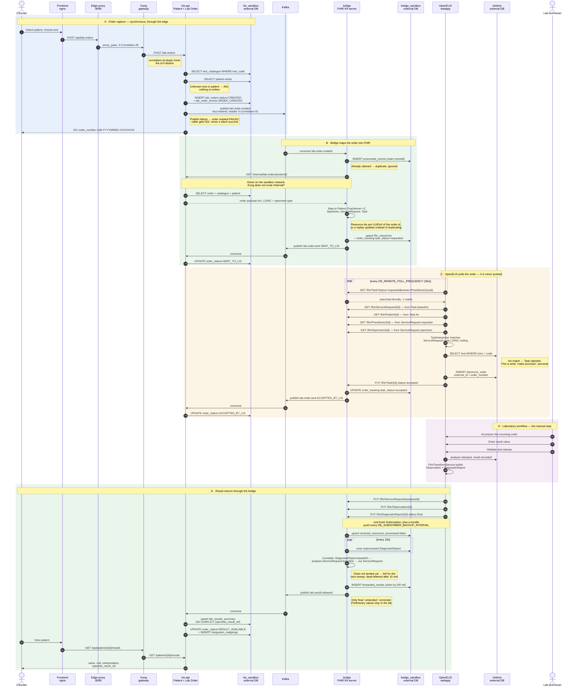
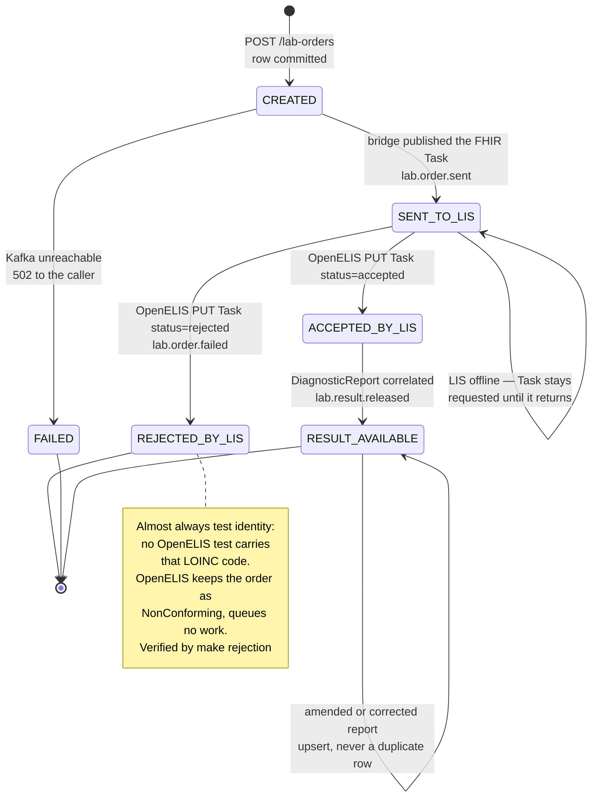
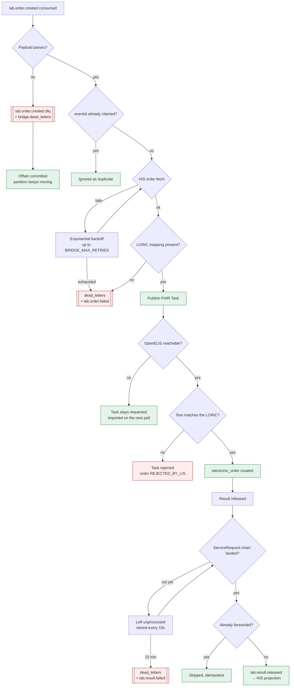
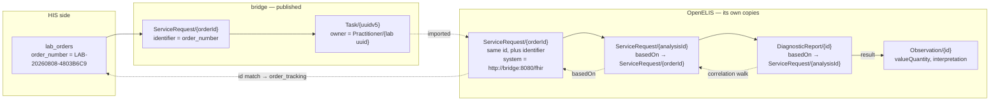

# Data flow — full round trip

Every hop below was observed in a live run against OpenELIS Global 2 on the
upstream `develop` images. Endpoint paths, topic names, table names and status
values are the real ones, not illustrative.

---

## 1. The round trip

A single order, from a clinician typing it to the released result appearing
back in the HIS. The five phases are marked; phase D is the only one a human
drives.

---

## 2. Where the data lives, and what may talk to what

Network membership *is* the boundary. The bridge is the only container on both
`sandbox` and `integration`, which makes it the only path between the two
systems. No application container shares a network with a database it does not
own.

Three databases, three owners, no shared credentials — verified: the bridge's
role is refused `CONNECT` on `his_sandbox`, and OpenELIS holds no HIS
credentials at all.

---

## 3. Order status lifecycle

Each transition is driven by a specific event, so a stuck order tells you
exactly which hop failed.

---

## 4. Failure and recovery paths

What happens when a hop breaks, and how the data gets through anyway.

Every arrow above is exercised by `make negative`, except the two dead-letter
timeouts, which are time-based.

---

## 5. The two identifiers that hold it together

Correlating a released result back to a HIS order is the subtlest part of the
design, because OpenELIS renames nothing but re-parents everything.

Two facts make the walk reliable, both confirmed against resources OpenELIS
actually pushed back:

- OpenELIS **preserves our `ServiceRequest` id** when it imports the order, so
  the parent reference resolves directly against `bridge.order_tracking`.
- It also stamps its own identifier on that copy
  (`system = http://bridge:8080/fhir`) **and keeps our order-number
  identifier**, giving a second, independent way to match if the id chain ever
  breaks.

The bridge tries the direct id match first, then the parent hop, then the
order-number identifier — see `ResolveOrderAsync` in
[ResultCorrelator.cs](../services/Bridge/ResultCorrelator.cs).
