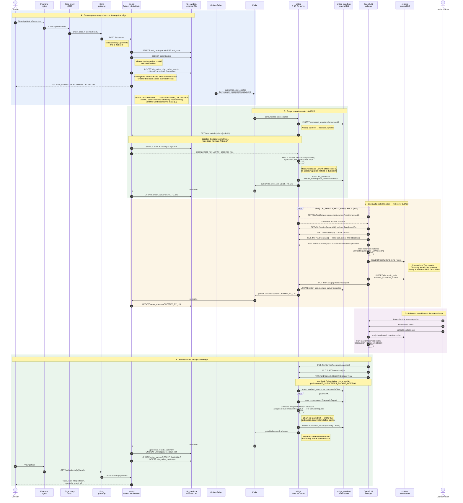
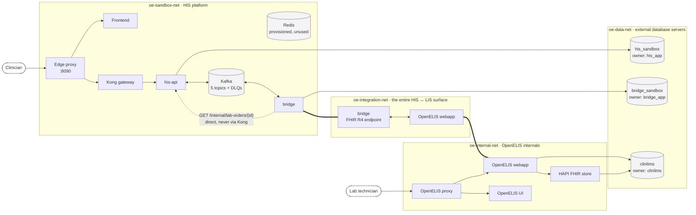
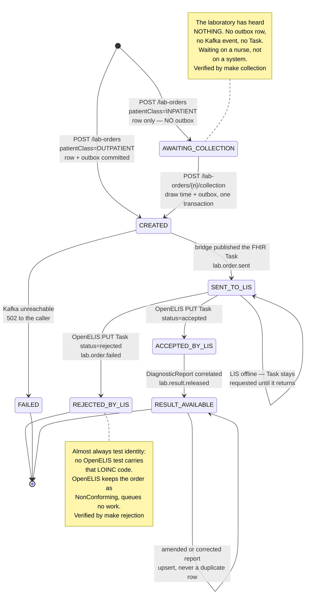
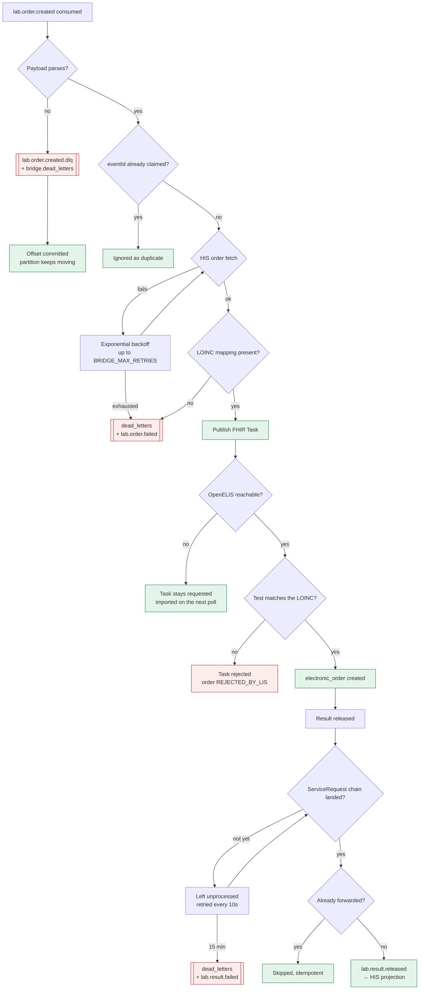
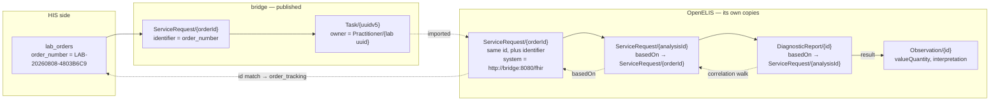
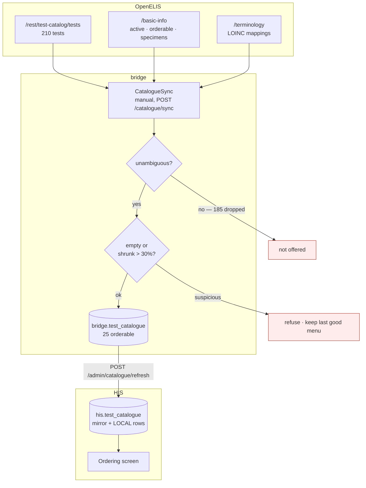
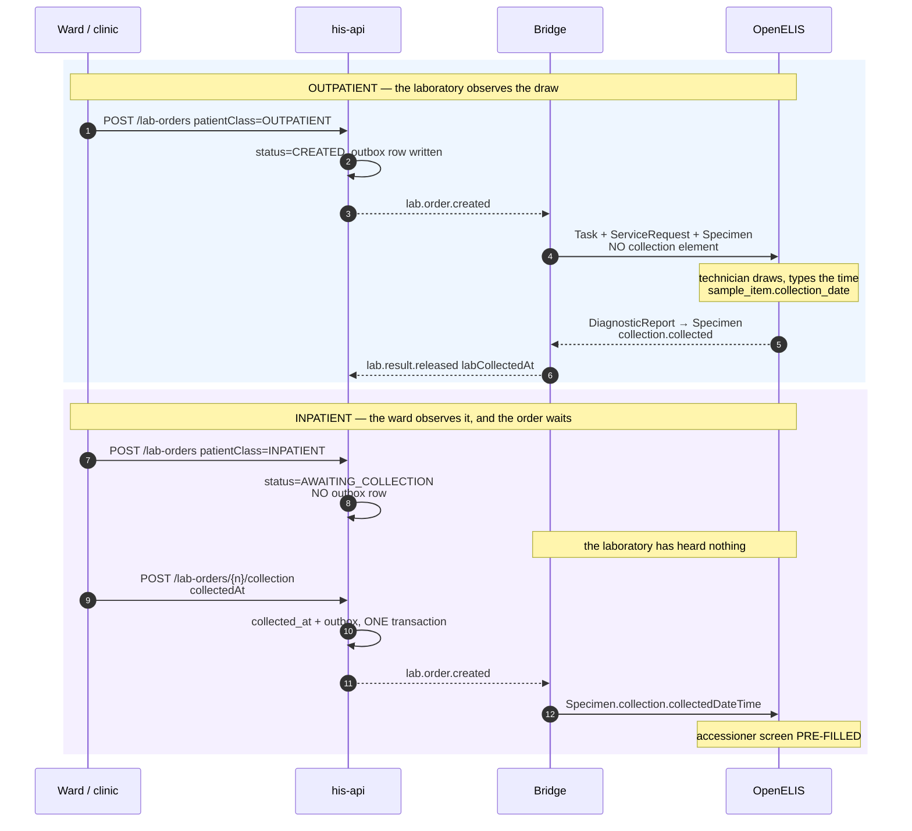

# Data flow — full round trip

Every hop below was observed in a live run against **OpenELIS Global 2 3.2.2.0**
(tag `aa00894`). Endpoint paths, topic names, table names and status values are
the real ones, not illustrative.

---

## 1. The round trip

A single order, from a clinician typing it to the released result appearing
back in the HIS. The five phases are marked; phase D is the only one a human
drives.



---

## 2. Where the data lives, and what may talk to what

Network membership *is* the boundary. The bridge is the only container on both
`sandbox` and `integration`, which makes it the only path between the two
systems. No application container shares a network with a database it does not
own.



Three databases, three owners, no shared credentials — verified: the bridge's
role is refused `CONNECT` on `his_sandbox`, and OpenELIS holds no HIS
credentials at all.

### Membership was doing more work than it should have

The diagram makes network membership look like a complete boundary, and for the
*databases* it is. For the bridge's own HTTP surface it was not: `bridge` sits
on `sandbox` and `integration`, and it served `/fhir`, `/ops/*` and
`/catalogue/*` on one port to both. Anything on `sandbox` — the HIS service,
the frontend, Kong, Redis — could post a `DiagnosticReport` to `/fhir`, and a
fabricated `DiagnosticReport` is a fabricated patient result.

The surface is now split by *what the caller is*, not by which port it arrived
on:

| Surface | Who | How they are checked |
|---|---|---|
| `/fhir` | OpenELIS | **origin** — the peer's address must resolve from `BRIDGE_FHIR_ALLOWED_PEERS` |
| `/ops/*`, `/catalogue/sync` | operators | **bearer token**, fail-closed |
| `/healthz`, `GET /catalogue` | anything internal | open, read-only, unchanged |

The first row is an origin check rather than a credential for a reason that is
not going to change: OpenELIS 3.2.1.11 has no way to send one. The evidence is
in [`security.md` §3](security.md#3-why-the-fhir-endpoint-has-no-token); the
short version is that its `BasicAuthInterceptor` is gated on the target being
its own local FHIR store, and there is no configuration key for remote-source
credentials at all. Demanding a token on `/fhir` would not secure the
integration, it would stop it.

That makes this the one boundary in the system held by something weaker than a
credential, which is worth knowing rather than glossing.

---

## 3. Order status lifecycle

Each transition is driven by a specific event, so a stuck order tells you
exactly which hop failed.



### AWAITING_COLLECTION is not a failure, and not progress

It is the only state in which **nothing has been sent to the laboratory** — no
outbox row, no Kafka event, no FHIR Task. An order sitting here is not stuck in
a hop; it is waiting on a physical act that has not happened.

That distinction matters when something looks wrong. Every other stalled state
means a system did not do its job. This one means **a specimen has not been
drawn**, and no amount of restarting anything will move it.

Only an inpatient order enters it. An outpatient specimen is drawn in the
laboratory, so its order dispatches at creation and the laboratory reports the
collection time back — see [§7](#7-who-observes-the-draw).

---

## 4. Failure and recovery paths

What happens when a hop breaks, and how the data gets through anyway.



Every arrow above is exercised by `make negative`, except the two dead-letter
timeouts, which are time-based.

---

## 5. The two identifiers that hold it together

Correlating a released result back to a HIS order is the subtlest part of the
design, because OpenELIS renames nothing but re-parents everything.



Two facts make the walk reliable, both confirmed against resources OpenELIS
actually pushed back:

- OpenELIS **preserves our `ServiceRequest` id** when it imports the order, so
  the parent reference resolves directly against `bridge.order_tracking`.
- It also stamps its own identifier on that copy
  (`system = http://bridge:8080/fhir`) **and keeps our order-number
  identifier**, giving a second, independent way to match if the id chain ever
  breaks.

The bridge tries the direct id match first, then the parent hop, then the
order-number identifier — see `ResolveOrderAsync` in
[ResultCorrelator.cs](../services/Bridge/ResultCorrelator.cs).

The **parent hop is the one that matters in practice**. A real released result,
captured from OpenELIS rather than simulated, arrived as
`DiagnosticReport.basedOn → ServiceRequest/f71f7cc1… → ServiceRequest/LAB-…`.
A correlator that only looked one level deep — the obvious implementation —
would have passed every simulated test and failed on every real result.

## 6. Where the test menu comes from

The HIS does not decide which tests exist. OpenELIS does, and the bridge asks it.



A test is offered if OpenELIS reports it **active**, **orderable**, holding
**exactly one LOINC**, and carrying a sample type with a **local abbreviation**.
The menu currently holds **17 rows**.

**One row per (test, specimen), not per test.** A LOINC says what is measured,
not what it is measured in, so `10351-5` names three orderable things — HIV
viral load on serum, on plasma, on DBS. Offering them as one row forced somebody
to guess the specimen later. Offering them as three lets the **doctor** choose,
at the only point in the workflow where the answer is certain: they know what
will be drawn.

> **This section previously said the opposite** — that OpenELIS matches on the
> LOINC alone and ignores the `Specimen`. That was true of the version it was
> written against. **3.2.2.0 does resolve by specimen** (`OGC-1145`), which is
> what took the menu from 4 tests to 17.

What is still refused is a LOINC **and** specimen claimed by two active tests:
`94547-7` is mapped to both COVID IgG and IgM on the same specimens, so nothing
in an order could separate them. All four are dropped and the sync log names
them. That is a mapping error in the laboratory's catalogue, and the sync
surfacing it is the loop working — fix the mapping and they appear on the next
sync, with no code change.

**How the specimen actually travels** matters, because getting it wrong fails
*silently*. OpenELIS reads one `Specimen.type.coding` entry whose system is
exactly `<oeFhirSystem>/sampleType` and matches its code against
`type_of_sample.local_abbrev` — which is **not** the display name
(`Whole Blood` is stored as `Whole Bld`). Miss it and OpenELIS binds the first
active test on the LOINC and reports success. The catalogue therefore syncs both
forms, and the order carries the abbreviation alongside SNOMED. Full detail in
[integration-field-map.md](integration-field-map.md#3-why-the-specimen-is-load-bearing).

**Sync is manual.** A clinic changes its menu when it commissions an analyser, a
few times a year, so a timer would run thousands of times to catch that and
would slide changes in unnoticed. The person who enabled the test in OpenELIS
presses the button and reads the diff:

```
$ make sync-catalogue
    applied: True | 29 -> 25
    - 2160-0 Creatinine [Plasma]
    - 718-7 Hemoglobin (Bld) [Mass/Vol] [Whole Blood]
```

**The HIS keeps a mirror rather than calling through**, for two reasons that
outrank freshness: `lab_orders.test_code` has a foreign key into it, so a test
that has ever been ordered can never be dropped — it is deactivated instead; and
the ordering screen must keep working while the bridge restarts. A menu one sync
out of date beats an empty one.

### Watching the channel results arrive on

A laboratory that has stopped returning results looks exactly like a laboratory
with nothing ready — the bridge receives nothing either way. Orders queue up
visibly in `ACCEPTED_BY_LIS`, but the *return* path failing is silent, and the
detection mechanism was a clinician eventually asking where a result went.

OpenELIS already knows. `/rest/DataExportStatus` reports each push subscription
by endpoint, including ours, and the bridge polls it:

```
$ make export-status
    OK — last push 1 min ago, 66 in 24h
```

Staleness is judged against `maxIntervalMinutes` — the cadence OpenELIS says it
intends to keep — rather than a threshold picked here, so the check stays correct
if the laboratory changes how often it pushes. Verdicts are `OK`, `STALE`,
`FAILING`, or `UNREACHABLE`, because not being able to ask is its own state and
reporting healthy in that case would be worse than useless.

This one is **polled**, unlike the catalogue, and the difference is the point:
export health changes minute to minute and nobody presses a button to ask about
it, whereas the test menu changes a few times a year and the person who changed
it should see the diff.

### One limit, stated plainly

OpenELIS holds LOINC codes in two places — `clinlims.test.loinc`, which binds
incoming orders, and `test_terminology_mapping`, which the REST API reports —
and they can disagree. Discovery currently **under-offers**, which is the safe
direction. The unsafe direction cannot be ruled out from the bridge, because
checking would mean reading OpenELIS's database, which section 2 forbids
outright.

What makes that acceptable is that drift is loud rather than silent: an order
OpenELIS cannot match returns `REJECTED_BY_LIS` with a reason, lands in the
order's audit trail, and is covered by the rejection suite.

---

## 7. Who observes the draw

A collection time is a fact about a physical event, and only whoever watched it
can state it. That one rule decides everything below, including which direction
the data moves.

Why it is worth the trouble: the results table used to show a single time, the
moment the laboratory signed the result out. A doctor reading "released 11:30"
at 11:35 concludes the value is current. If the blood was drawn at 06:00 it is
five and a half hours old and the patient has had fluids since. Nothing on the
screen was wrong; there was not enough of it. ISO 15189:2022 7.4.1.7.a requires
the collection time when it matters for patient care, and this is the case it
matters for.



### Why an inpatient order waits

The draw happens after the order is placed, so the collection time does not
exist at creation. It cannot be sent afterwards either: once OpenELIS imports a
Task it moves the status off `requested` and never polls it again, so a
follow-up update is never read.

Holding is also the honest position. Until the tube exists there is nothing for
the laboratory to act on, and an order in the Incoming Orders queue for a
specimen nobody has drawn is a queue entry that means nothing.

The collection time and the outbox row commit **together**. Either alone is a
failure that retrying cannot fix: a time with no dispatch strands the order with
a nurse believing the job is done, and a dispatch with no time loses the only
reason the order was waiting.

### What survives, and what does not

| Direction | Field | Fate |
|---|---|---|
| HIS → OpenELIS | `Specimen.collection.collectedDateTime` | **read** by `LabOrderSearchProvider.addCollection`, pre-filled onto the accessioner's screen, persisted to `sample_item.collection_date` |
| HIS → OpenELIS | `Specimen.collection.collector` | read on import (`item.setCollector`) — but we do not send one |
| HIS → OpenELIS | `Specimen.receivedTime` | **no longer sent** — see below |
| OpenELIS → HIS | `Specimen.collection.collected` | populated from `sample_item.collection_date` |
| OpenELIS → HIS | `Specimen.collection.collector` | **silently dropped** — `transformToCollection` accepts the parameter and never uses it |

`Specimen.receivedTime` used to carry the order creation time, which told the
laboratory it had received a specimen at the moment the doctor clicked "order",
before anyone had drawn blood. Receipt is an event the laboratory observes in
its own building; asserting it from here was a false statement in a clinical
record about someone else's premises. It is gone.

### Two traps, both verified in 3.2.2.0 source

**`Observation.effective` is the RELEASE time, not the collection time.** FHIR
convention says `effective` is the diagnostically relevant time, and US Core
describes it as *"typically the time of specimen collection"*. OpenELIS sets it
to `analysis.getReleasedDate()`, falling back to `getStartedDate()`
(`FhirTransformServiceImpl`). A developer following the specification gets a
plausible timestamp, hours wrong, with nothing failing. The real value is on the
`Specimen` that `DiagnosticReport.specimen` references.

**A `collection` element does not imply a collection date.** OpenELIS calls
`specimen.setCollection()` unconditionally, while `setReceivedTime()` directly
above it is null-guarded. A specimen with no collection date still arrives
carrying a `collection` element built around a null, so testing for the element
is not enough — the reader checks for the date itself.

### When nobody wrote it down

Both columns are nullable and null is a first-class state, displayed as **"not
recorded"**.

That is not a gap left open. An inpatient draw the ward did not record is
genuinely unknown, and the accessioner can only type what someone wrote on the
tube. The alternative — quietly substituting a received or released time — would
be indistinguishable from an observed collection time, and a clinician would act
on it. A fabricated collection time is worse than none.

One configuration note for a real deployment: OpenELIS has a site setting that
auto-fills the collection date. This instance has `auto-fill collection
date/time = false`, so an accessioner who does not know the draw time leaves it
blank rather than stamping the arrival time. **Check that setting before
trusting the field at any real site.**

---

## 8. Referral testing — what is ready, and what is not

When our laboratory cannot perform a test it sends the specimen to another
laboratory. Nothing in this sandbox does that yet, and no referral has ever run
— what follows is the state of the plumbing, verified against 3.2.2.0 source and
against the live instance.

### OpenELIS has a real referral module

Not a stub. `clinlims.referral` records the receiving `organization_id` and
`organization_name`, `sent_date`, `result_recieved_date`, a reason, a priority,
and the unhappy paths explicitly — `lost_status` / `lost_date` / `lost_reason`
and `canceled` / `cancel_reason`. `referral_result` links the value that came
back, and `shipment` / `shipping_box` track the physical package.

The vocabularies ship seeded: ten `referral_reason` rows ("Equipment failure",
"Confirmation requested", "Reagents unavailable"…) and four `referral_type`
rows. `organization_type` id **6** is `referralLab` — *"An organization to which
samples may be sent"* — and a reference laboratory has to be tagged with it
before it can be selected.

The workflow is worklist-driven (`ReferredOutTests`) or triggered at result
entry. It is **post-accessioning**: a sample is referred after it arrives, not
instead of arriving.

Two columns that look relevant and are not: the `so_*` family on `analysis`
(`so_send_date`, `so_notify_received_date`, …) is dead code with no
business-logic call sites, as is `referring_test_result`. `referral` /
`referral_result` is the live module.

### The gap that decides how hard this is

**`DiagnosticReport.performer` and `Observation.performer` are never set
anywhere in OpenELIS** — zero call sites for `setPerformer` or `addPerformer`.
No field on a returning result says who actually performed it.

That matters beyond convenience: ISO 15189:2022 7.4.1.7.c and CLIA
42 CFR 493.1291(i)(3) both place the duty to name the performing laboratory on
the *referring* laboratory's report. A result that leaves OpenELIS carrying no
performer cannot satisfy that downstream without reconstruction.

So naming the laboratory means walking a chain rather than reading a field:

```
DiagnosticReport → the analysis it belongs to
                 → the referral Task    (referral.fhir_uuid, published by
                                         FhirReferralServiceImpl)
                 → the Organization the Task names
```

**That chain has never been exercised.** No referral Task has ever reached this
bridge, so the shape of one is unverified and nothing here should be built
against an assumption about it.

### What was done ahead of time, and why

`Organization` has been added to
`org.openelisglobal.fhir.subscriber.resources` and to the bridge's
`SupportedTypes`, taking the registered subscriptions from 8 to 9 — confirmed
active against the FHIR store, with `make export-status` still `OK`.

Subscribing before there is anything to receive is deliberate. **Resources are
pushed when they change.** A reference laboratory configured last month is not
re-pushed merely because we started listening today, so subscribing after the
first referral can leave us holding a Task pointing at an Organization we never
received. The mirror correctly holds no `Organization` today: the single
configured organization has not changed since.

> **Trap for anyone editing that property.** The bridge's `SupportedTypes` must
> stay a **superset** of the subscriber resource list. OpenELIS registers one
> Subscription per name and pushes unconditionally; a type it pushes that the
> bridge does not accept is refused at the door, which surfaces as a permanently
> failing export on the *laboratory's* side and nothing visible on ours. Adding
> a name to the property without adding it to the bridge is strictly worse than
> not subscribing at all.

### The signal worth having first

Naming the performing laboratory is the harder half. The more useful half is
cheaper: **telling the ward that a test went out at all.**

A send-out takes days rather than hours. Today an order would sit at
`ACCEPTED_BY_LIS` for a week with no explanation and the ward would telephone
the laboratory. `REFERRED_OUT` belongs on the existing `lab_progress` channel
alongside `IN_LABORATORY` and `AWAITING_VALIDATION` — not as an order status,
because the integration state has not changed; the laboratory has the order and
is working on it.

Two more, from the dedicated publishers `publishReferralLost` and
`publishReferralRejected`:

| Progress | What the ward does |
|---|---|
| `REFERRED_OUT` | stop expecting it tomorrow; stop telephoning |
| `REFERRAL_LOST` | **redraw the patient** |
| `REFERRAL_CANCELLED` | the test is not coming; decide what to do instead |

`REFERRAL_LOST` should not be a quiet grey note. A specimen that never arrived
means somebody needs another needle, and nobody discovers that by watching a
screen — it belongs with the correction alerting in
[integration-guide.md § Step 6b](integration-guide.md#step-6b--corrections-need-an-alert-not-a-badge).

### The one instruction that matters now

Configuring a reference laboratory is a laboratory-administration act, done in
the OpenELIS UI, and this project does not write OpenELIS data. But the rule
should be given to the laboratory **before the first send-out**, because it is
unrecoverable afterwards:

> When a specimen is sent to another laboratory, use OpenELIS's referral
> function. Do not enter the result as though it was performed in-house.

A result typed in as in-house has no organisation, no sent date and no link to
the sample that left the building. A year of send-outs recorded that way cannot
be reconstructed, and each one is a result the clinician will trend against an
in-house value as though the two were comparable.
